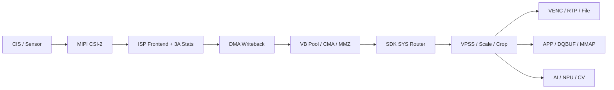
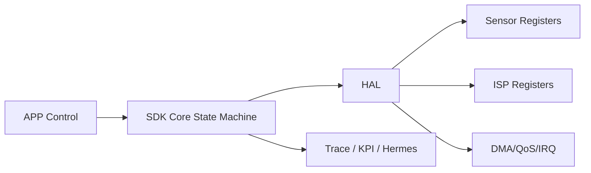

# ISP 视频数据流架构与运行优化指南

## 目标

本指南面向 ISP 芯片视频 SDK 开发，目标是把 CIS -> ISP -> DMA -> DDR -> CPU -> APP 这条主数据链路彻底打通，并为后续 Hermes 一类运行时优化系统提供可观测指标、优化抓手和统一架构语言。

重点覆盖以下问题：

- 不同 CIS、不同 ARM 架构下的跨平台 SDK 设计
- 双目/多路视频流的零拷贝与缓冲区管理
- SMP、AMP、ARMv5 的差异化优化策略
- 视频出帧、分辨率切换、DDR 带宽、DMA/Cache 问题排查
- 后续接入 Hermes 或其他运行时分析系统时应采集的 KPI

## 分层架构

```text
+---------------------------------------------------------------+
| 应用层: RTSP / Recorder / AI / WebRTC / Preview               |
+---------------------------------------------------------------+
| SDK Core: 状态机 / VB Pool / SYS 路由 / 时间戳 / 统计聚合       |
+---------------------------------------------------------------+
| HAL: Sensor 驱动 / ISP 配置 / DMA / Cache / IRQ / QoS          |
+---------------------------------------------------------------+
| OS/FW: Linux SMP | RTOS | Bare-Metal | Cortex-M/DSP 3A 固件    |
+---------------------------------------------------------------+
| 硬件: CIS -> MIPI CSI -> ISP -> DMA -> DDR -> VENC/NPU/Display |
+---------------------------------------------------------------+
```

核心原则：

- SDK Core 只管理状态、缓冲区所有权和拓扑路由，不直接耦合具体 SoC 寄存器。
- HAL 负责屏蔽不同 ISP、DMA、Cache、IRQ 控制器差异。
- 逐帧热路径只传递 Buffer ID、DMABUF FD、物理地址或 Metadata，禁止中间层 memcpy。
- 3A 实时算法必须留在最靠近硬件的一侧，Linux/App 侧只下发模式和策略。

## 数据平面与控制平面

### 数据平面



### 控制平面



如果是 AMP 架构，应补一条控制面：

```text
Linux Cortex-A <-> Mailbox/Inter-CPU IRQ <-> Cortex-M/DSP 3A FW
Linux Cortex-A <-> Shared Memory Ring <-> Cortex-M/DSP Metadata
```

## SDK Core 的关键抽象

### 1. 统一 VB Pool

- 启动时静态预留连续物理内存，优先使用 CMA、MMZ、ION、DMABUF Heaps 一类机制。
- 所有视频帧都归属统一的 VB Pool 管理器，使用引用计数追踪帧生命周期。
- 输出给应用层时，优先交付 DMABUF FD 或 Physical Address，而不是复制一份内存。
- 三缓冲是下限，双目或多分支时建议主路 4 缓冲，缩放分支 2 缓冲。

### 2. 拓扑路由 SYS

- SDK Core 内部维护一张图：输入节点、处理节点、输出节点、缓冲区所有者、时间戳。
- 每个节点的职责是“消费一个 Buffer，再产出一个 Buffer 引用”，而不是持有裸指针做私有缓存。
- VPSS、VENC、AI 分支统一走图路由，避免应用层私自做旁路拷贝。

### 3. 全链路时间戳

至少保留以下时间点：

- t0: Sensor FS
- t1: CSI SOF/EOF
- t2: ISP DMA Done
- t3: IRQ Ack 完成
- t4: SDK Core 入队 VB Pool
- t5: DQBUF 返回应用层
- t6: VENC 输出码流

建议衍生指标：

- fs_to_dma_done_ms
- dma_done_to_dqbuf_ms
- dqbuf_to_app_consume_ms
- dma_irq_hz
- qbuf_depth
- vb_pool_used_pct

## 架构差异化设计

### SMP

适用：多核 Cortex-A + Linux。

建议：

- 收帧线程、DQBUF/QBUF 线程、ISP 下半部尽量绑同一个 CPU 核。
- 如果 SoC 支持 IRQ affinity，把 CSI/ISP/VENC 中断绑到与收帧线程同核。
- 用 isolcpus、cpuset 或 cgroup 给关键线程留核，减少被日志、网络、推理线程打断。
- 应用层不要在取流线程里做重计算；VENC、AI、网络发送应拆到独立线程。

### AMP

适用：Cortex-A Linux + Cortex-M/DSP/RTOS。

建议：

- 逐帧 3A 计算必须放在 M 核、DSP 或 ISP 固件侧，A 核只下发模式切换策略。
- Mailbox 只传命令、事件和短状态，不传整帧数据。
- Shared Memory Ring 只传 Metadata、统计块、Buffer Handle。
- 共享内存访问必须定义所有权和序号，防止 Linux 与固件双写。

### ARMv5

适用：单核、无 NEON、浮点弱或无 MMU 的老平台。

建议：

- 所有实时热路径使用定点数，避免 float 和 double。
- 固件启动时一次性分配静态结构，避免运行期频繁 malloc/free。
- 先在 ISP/VPSS 做降采样或裁剪，再交给 CPU。
- 对 4MP 以上输入应优先在硬件侧降到 1MP~2MP 再给算法或应用层。

## 视频出帧优化

### 三缓冲与早回收

最小推荐模式：

- Buffer A: DMA 正在写入
- Buffer B: VPSS/VENC/APP 正在消费
- Buffer C: 已经 QBUF，等待下一帧写入

优化要点：

- DQBUF 之后尽快决定去向，不要在应用层阻塞太久再 QBUF。
- 若应用层只关心 Metadata，应只取时间戳、曝光值、AI 结果，不触碰整帧像素。
- 若需要多分支，优先在 VPSS 处分叉，而不是在 APP 拿到主码流后再复制。

### 分辨率切换

推荐状态机：

```text
RUNNING
  -> STOP_VENC
  -> STOP_VPSS
  -> STOP_VI
  -> SENSOR_GROUP_HOLD_SWITCH
  -> RECONFIG_MIPI_DPHY
  -> REBUILD_VI_VPSS_VENC
  -> RELEASE_OLD_BUFFERS
  -> RESYNC_TIMESTAMPS
  -> RUNNING
```

避免以下错误：

- 不停流直接改 VI/VPSS/VENC 宽高
- 先申请新缓冲再释放旧缓冲，导致峰值内存翻倍
- 切分辨率时不发 IDR，导致解码端仍按旧 SPS/PPS 解析

## DMA、Stride、Cache 问题排查

| 现象 | 常见根因 | 排查重点 | 建议 |
|---|---|---|---|
| 斜绿条、错位、花屏 | Stride 与 Width 不匹配 | 检查 DMA 行步长寄存器、RAW10/RAW12 打包方式、64B 对齐 | 使用 ALIGN(width_bytes, 64) 重新计算 stride |
| 上半部分正常，下半部分残影 | 带宽不足或 DMA 提前结束 | 检查 DDR 频率、AXI QoS、Frame End IRQ | 提高 ISP DMA 优先级，确认中断未被提前清标志 |
| 局部马赛克、色彩错乱 | Cache 一致性污染 | 查 DMA 前后是否 clean/invalidate；共享内存是否 coherent | 非一致性平台优先用 non-cacheable 流媒体内存 |
| DQBUF 卡死 | 中断未到、状态机丢失、QBUF 耗尽 | 看 /proc/interrupts、VB Pool 深度、DQBUF 超时 | 增加缓冲、追踪 t2/t4/t5 时间点 |
| 分辨率切换后绿边/花屏 | 旧 stride/旧 buffer 残留 | 检查 stop/rebuild 顺序、IDR、旧缓冲释放时机 | 采用完整 stop-rebuild-start 流程 |

### Cache 一致性基本规则

- DMA 写内存给 CPU 读：CPU 读前必须 invalidate。
- CPU 写参数给 DMA 读：DMA 启动前必须 clean/flush。
- 如果平台不支持 I/O Coherency，视频主流内存优先设为 non-cacheable 或 coherent memory。
- AMP 架构共享内存必须明确 cache policy，避免 A 核和 M 核各看见不同内容。

## Hermes 运行优化建议

后续要做 Hermes 一类运行时优化，建议至少采集以下 KPI：

| KPI | 含义 | 建议阈值 |
|---|---|---|
| sensor_irq_hz | Sensor/CSI 中断频率 | 接近目标 fps |
| dma_done_hz | DMA 帧完成频率 | 接近目标 fps |
| vb_pool_used_pct | VB Pool 使用率 | 常态 < 75% |
| dqbuf_latency_ms | DMA 完成到应用取帧时延 | 常态 < 1 帧周期 |
| qbuf_return_ms | 应用返还缓冲耗时 | 常态 < 0.5 帧周期 |
| venc_queue_depth | 编码队列深度 | 稳态不持续增长 |
| ddr_total_mb_s | 视频相关总 DDR 吞吐 | 常态 < 可用带宽 80% |
| cache_sync_fail_cnt | Cache 同步异常计数 | 应保持 0 |
| dyn_res_switch_ms | 变分辨率切换总耗时 | 应可预测且可回归 |

建议 Hermes 侧做三件事：

- 订阅状态机迁移和异常码，定位卡死节点。
- 定期抓取中断计数、缓冲深度、DDR 带宽、VENC 队列深度。
- 生成分辨率切换前后对比报表，自动标出 stride、buffer、IDR、cache 风险。

## 工具配套

仓库内新增了一个分析工具：

- video_pipeline_arch_optimizer.py

它用于：

- 梳理数据流和控制面
- 估算 RAW/YUV/DDR/VB Pool 压力
- 输出 SMP/AMP/ARMv5 对应的优化建议
- 导出 Markdown/JSON 报告，便于后续 Hermes 接入

## 落地清单

- 统一 VB Pool，禁止应用层私有帧缓存
- 建立 t0~t6 全链路时间戳
- 关键线程和 IRQ 做绑核或优先级隔离
- DMA/Cache/Stride 统一由 HAL 封装，禁止散落在业务代码
- 分辨率切换使用 stop-rebuild-start 状态机
- 采集 Hermes KPI，并对双目 4MP/3MP/2MP/1MP 建立回归基线
